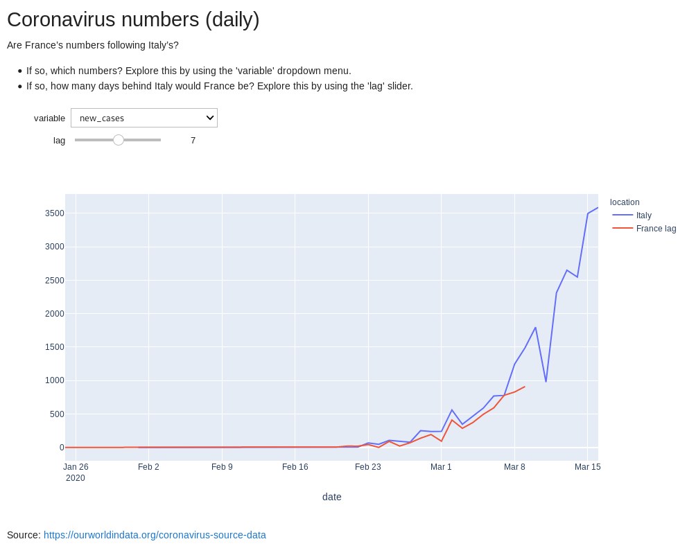

# covid-plots

Visualize daily timeseries of coronavirus cases with lag between France and Italy.

As of March 15, 2020:

* France's total cases seem 8 days behind Italy's;
* France's total deaths seem 10 days behind Italy's;
* France's new cases seem 7 days behind Italy's.
